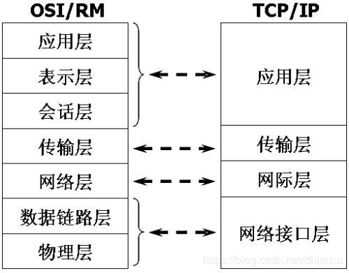

# 前端相关

    
JS核心概念 && 引擎V8

- [x] 执行上下文 EC、执行上下文堆栈 ECS
- [x] 全局对象 GO、变量对象 VO、活动对象 AO 等
- [x] 函数的[[scope]]属性
- [x] 作用域链 Scope chain
- [x] 原型链
- [x] 装箱和拆箱
- [x] 全等运算符（===）和相等运算符（==）
- [x] 元编程（metaprogramming）
- [x] 闭包原理
- [x] [IntersectionObserver 的应用](https://mp.weixin.qq.com/s/uRMYrxaduPaMkc97Upjkqg)
- [x] [ES5 继承的六种方式](./README/es5extends.md)
- [x] css 的下载解析 js 的下载解析与 html 解析的关系（阻塞）
- [x] [浏览器解析 HTML 和 CSS 与 JS 加载、解析的关系](./README/render.md)
- [x] [CustomEvent 的应用](./README/js_customEvent.md)

[图片来源](https://www.cnblogs.com/bibiafa/p/9364986.html) 
[jsCore.md](./README/jsCore.md)

---

- [x] V8 工作原理
- [x] 逃逸分析(Escape Analysis）
- [x] V8 如何优化对象（Hideen Class && Inline Cache）
- [x] V8 如何优化数组（动态使用不同存储模式：Fast Elements、Fast Holey Elements、Dictionary Elements ）
- [x] V8 如何优化数字（SMI、HeapNumber、MutableHeapNumber）
- [x] V8 如何优化字符串（v8 中字符串 5 种表达模式）
- [x] JIT 和 AOT
- [x] 垃圾回收（新生代和老生代内存回收方式）

[V8.md](./README/v8.md)

    
Hybrid APP && JS工具函数 && JS原生api模拟

- [x] h5 唤起 APP 方式
- [x] JSBridge

[Hybrid APP](./README/hybrid.md)

---

- [x] checkType 类型检查包含 String、Boolean、Number、Undefined、Null、Symbol、BigInt、Map、HTMLBodyElement、HTML\*Element 等
- [x] deepClone 深拷贝（包含循环引用）
- [x] 深拷贝（处理递归爆栈）
- [x] curry 柯里化函数
- [x] throttle、debounce
- [x] 千分位 regExp、Number.prototype.toLocaleString、Intl.NumberFormat().format(number)、reduce 版本
- [x] [Promise 并行和串行执行方式](./src/modules/utils.js)
- [x] [你不知道的 JSON.stringify()](https://juejin.im/post/5decf09de51d45584d238319)

[工具函数集合](./src/modules/utils.ts)

---

- [x] myCall、myApply、myBind 自定义 call、apply、bind 函数
- [x] instance_of(L, A) 模拟 L instanceof A 注意：Symbol.hasInstance 可自定义 instanceof 在某个类或构造函数的行为
- [x] objectFactory 模拟 new 运算
- [x] objectCreate 模拟 Object.create(proto, PropertyDescriptorMap)

[theory.ts](./src/modules/theory.ts)

    
Node.js && 工程化（Webapck）&& 基础建设

- [x] nodejs 清除 require 缓存
- [x] 高并发解决方案（负载均衡）
- [x] Event Loop

[Event Loop](./README/eventLoop.md)
[Node.js 事件循环](https://nodejs.org/zh-cn/docs/guides/event-loop-timers-and-nexttick/)
[node 相关](./README/NodeJs.md)

---

- [x] [项目架构相关](./README/framework.md)
- [x] [热更新原理](https://github.com/webpack/docs/wiki/hot-module-replacement-with-webpack#how-does-it-work)&&[webpack 热加载原理探索](http://shepherdwind.com/2017/02/07/webpack-hmr-principle/)
- [x] 自定义 Loader 原理探索
- [x] 自定义 Plugins 原理探索
      [webpack](./README/webpack.md)

---

- [x] SSH key
- [x] .npmrc
- [x] [npm 命令手册](./README/npm.md)
- [x] [yarn 命令手册](./README/yarn.md)
- [x] [brew 手册](./README/macOS.md)
- [x] [macOS 备忘录](./README/macOS.md)
      [基础建设](./README/basic.md)

    
WEB性能（监控） && 安全

- [x] [Navigation Timing API](https://developer.mozilla.org/zh-CN/docs/Web/API/Navigation_timing_API) && navigator.sendBeacon() 实现收集和上报

---

- [x] XSS（Cascading Style Sheets）攻击全称跨站脚本攻击
- [x] CSRF（Cross-site request forgery）跨站请求伪造
- [x] 点击穿透
- [x] click jacking 点击劫持
- [x] 控制台注入代码
- [x] 目录遍历漏洞（Directory traversal），也称之为路径遍历漏洞（Path traversal）[Web 安全漏洞之目录遍历](https://mp.weixin.qq.com/s/crceZP9TKOIwkjmlCEeIAw)
- [x] SQL 注入
- [x] DDoS（Distributed Denial of Service）分布式拒绝服务攻击
- [x] [JWT/深度理解 token](https://segmentfault.com/a/1190000020143933)
- [x] [Web 中的密码学（加密、哈希、编码、混淆）](./README/web_secret.md)
- [x] 浏览器策略：Trusted Types 的工作方式就是锁定以下危险函数的接收参数，如果是不安全的，就直接阻止。

    
WEB体验 && 数据可视化探索

- [x] 元素 focus 页面不滚动不定位的 JS 处理 button.focus({ preventScroll: true })
- [x] [Preload，Prefetch，Preconnect 和 Prerendering](./README/preload.md)
- [x] 表单的 [inputmode](https://developer.mozilla.org/zh-CN/docs/Web/HTML/Global_attributes/inputmode) 属性可调用不同输入面板，[autocomplete](https://developer.mozilla.org/zh-CN/docs/Web/HTML/Attributes/%E8%87%AA%E5%8A%A8%E5%AE%8C%E6%88%90%E5%B1%9E%E6%80%A7) 属性值为 one-time-cod 可从短信获取验证码等
- [x] [SEO](./README/seo.md)

---

- [x] [Canvas 添加事件/isPointinPath](https://segmentfault.com/a/1190000019239594)

    
React && VUE

### 16 以前生命周期

### 16 以后生命周期

- [x] [React 相关](./README/react.md)
- [x] [React hooks](./README/hooks.md)

[React v16.3 之后的组件生命周期函数](https://zhuanlan.zhihu.com/p/38030418)

---

### VUE 生命周期

    
CSS

- [x] 滚动穿透/控制浏览器过度滚动时的表现 CSS 属性 overscroll-behavior
- [x] [你知道我们平时在 CSS 中写的%都是相对于谁吗？](./README/css.md)
- [x] [堆叠上下文](./README/css_stack_context.md)
- [x] [BFC](https://developer.mozilla.org/zh-CN/docs/Web/Guide/CSS/Block_formatting_context)
- [x] [Containing Block/包含块](https://developer.mozilla.org/zh-CN/docs/Web/CSS/All_About_The_Containing_Block)
- [x] 盒模型、reflow/repaint 等
- [x] [Grid 布局手册](./README/css_grid.md)
- [x] transform 失效（块级元素 和 原子行内级盒子元素起作用）
- [x] [CSS 给 JS 传参](https://www.zhangxinxu.com/wordpress/2020/02/css-params-to-js/)

# 服务端相关

    
网络相关

- [x] ISO 七层模型
- [x] TCP 三次握手建立连接和四次握手终止连接
- [x] HTTPS 工作原理
- [x] HTTP2 特性
- [x] [HTTP Security Headers](./README/HTTPSecurityHeaders.md)
- [x] [HTTP 缓存头部](./README/HTTPcache.md)
- [x] [HTTP 访问控制（CORS）](https://developer.mozilla.org/zh-CN/docs/Web/HTTP/Access_control_CORS)
- [x] [HTTP Headers 手册](./README/http_headers.md)
- [x] [HTTP Methods 手册](./README/http_methods.md)
- [x] [php 相关](./README/php.md)
- [x] [docker 相关](./README/docker.md)
- [x] [linux && shell 手册](./README/linux.md)

[服务端相关](./README/net.md)

    
nginx

- [x] 端口转发
- [x] 实现负载均衡
- [x] 特殊文件下载
- [x] 网站基础认证
- [x] 实现 ip 访问限制
- [x] 实现前端跨域
- [x] 配置 CORS
- [x] 适配 PC 与移动环境
- [x] 合并资源
- [x] 图片处理
- [x] 实现防盗链

[网络相关](./README/nginx.md)

    
场景需求（SSO、oAuth、秒杀）

- [x] [SSO 相同域及不同域](./README/backend_sso.md)
- [x] [oAuth2.0 工作原理](./README/oAuth.md)
- [x] [跨域身份验证解决方案](https://mp.weixin.qq.com/s/_f5MZa30VhmaqwDs_sx6vA)
- [x] [秒杀](./README/商品秒杀.md)

# 计算机 && 网络

    
OSI七层模型 && TCP/IP五层模型 的理解

- [x] OSI 七层模型
- [x] TCP/IP 五层模型
     
    [TCP](./README/internet.md)

# Geek 训练

    
工具使用技巧 && 快捷键

- [x] [快捷键备忘录](./README/keyboardShortcuts.md)

# 算法和数据结构

    
算法

如果要刷下算法的话，这里推荐大家去[牛客网](https://www.nowcoder.com/)和[leetcode](https://leetcode-cn.com/)。
- [x] [二分查找+6 种变体](./src/utils/binarySearch.js)

    
数据结构

下面只是给出常用数据结构定义，对应数据结构知识点请移步[详细介绍请移步](./README/dataStructure.md)。
用 JavaScript 来实现以下数据结构。 
线性结构：线性表，栈( Stack)，队列(Queue)。 
非线性结构：数组(Array)，广义表，树( Tree)，堆(Heap)，图(Graph)。 
存储唯一值的数据结构：集合、字典、散列表。 
其他： 链表( Linked List)，散列表(Hash Table)。

## 线性表

线性表包括顺序表（用于需要频繁查找，很少进行插入和删除操作时）和链表（频繁插入和删除）。

## 广义表

广义表是线性表的推广，线性表中的元素都是原子的单元素，而广义表中的元素可以是原子的单元素，也可以是一个子广义表。

## 数组、栈、队列、链表、字典、散列表、树、图

[详细介绍请异步](./README/dataStructure.md)

## 🌲 相关的结构

### 二叉树

每个节点最多含有两个子树的树称为二叉树。

### 完美二叉树/满二叉树（Full Binary Tree）

一个二叉树，如果每一个层的结点数都达到最大值，则这个二叉树就是满二叉树。也就是说，如果一个二叉树的层数为 K，且结点总数是(2^k) -1 ，则它就是满二叉树。

### 完全二叉树（Complete Binary Tree）

对于深度为 K 的，有 n 个结点的二叉树，当且仅当其每一个结点都与深度为 K 的满二叉树中编号从 1 至 n 的结点一一对应时称之为完全二叉树。（也就是说除深度为 k 的层不满，其余各层必须满，并且最下层上的结点都集中在该层最左边的若干位置上）

### 二叉搜索树

二叉排序树（Binary Sort Tree），又称二叉查找树（Binary Search Tree），亦称二叉搜索树。 
二叉排序树或者是一棵空树，或者是具有下列性质的二叉树：
（1）若左子树不空，则左子树上所有节点的值均小于它的根节点的值；
（2）若右子树不空，则右子树上所有节点的值均大于它的根节点的值；
（3）左、右子树也分别为二叉排序树；
（4）没有键值相等的节点。

### 平衡树（Balanced Binary Tree）

它是一棵空树或它的左右两个子树的高度差的绝对值不超过 1，并且左右两个子树都是一棵平衡二叉树。

### 哈夫曼树（Huffman Tree）

给定 N 个权值作为 N 个叶子结点，构造一棵二叉树，若该树的带权路径长度达到最小，称这样的二叉树为最优二叉树，也称为哈夫曼树(Huffman Tree)。哈夫曼树是带权路径长度 WPL 最短的树，权值较大的结点离根较近。 
所谓树的带权路径长度，就是树中所有的叶结点的权值乘上其到根结点的路径长度（若根结点为 0 层，叶结点到根结点的路径长度为叶结点的层数）。 
哈夫曼研究这种最优树的目的为了优化对字符进行编码（最短的编码信息放更多的信息）。

### 哈夫曼编码(Huffman Coding)

哈夫曼编码(Huffman Coding)，又称霍夫曼编码，是一种编码方式，可变字长编码(VLC)的一种。
变长编码表是通过一种评估来源符号出现机率的方法得到的，出现机率高的字母使用较短的编码，反之出现机率低的则使用较长的编码，这便使编码之后的字符串的平均长度、期望值降低，从而达到无损压缩数据的目的。 
关键点：由哈夫曼编码是可变字长编码，则必须是任一字符的编码都不是另一个字符的编码的前缀，这种编码称作前缀编码。

### 堆（Heap）

堆通常是一个可以被看做一棵完全二叉树的数组对象。 
将根节点最大的堆叫做最大堆或大根堆，根节点最小的堆叫做最小堆或小根堆。

