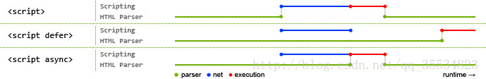

# JavaScript 核心概念
- [x] 执行上下文EC、执行上下文堆栈ECS
- [x] 全局对象GO、变量对象VO、活动对象AO等
- [x] 函数的[[scope]]属性 
- [x] 作用域链 Scope chain
- [x] 装箱和拆箱
- [x] 全等运算符（===）和相等运算符（==）
- [x] 元编程（metaprogramming）
- [x] 闭包原理
- [x] [IntersectionObserver的应用](https://mp.weixin.qq.com/s/uRMYrxaduPaMkc97Upjkqg)
- [x] [ES5继承的六种方式](./README/es5extends.md)
- [x] css的下载解析js的下载解析与html解析的关系（阻塞）
- [x] [浏览器解析HTML和CSS与JS加载、解析的关系](./README/render.md)

[图片来源](https://www.cnblogs.com/bibiafa/p/9364986.html)
[jsCore.md](./README/jsCore.md)

# JavaScript引擎探索（主要V8）
- [x] V8工作原理
- [x] 逃逸分析(Escape Analysis）
- [x] V8如何优化对象（Hideen Class && Inline Cache） 
- [x] V8如何优化数组（动态使用不同存储模式：Fast Elements、Fast Holey Elements、Dictionary Elements ） 
- [x] V8如何优化数字（SMI、HeapNumber、MutableHeapNumber）
- [x] V8如何优化字符串（v8中字符串5种表达模式）
- [x] JIT和AOT
- [x] 垃圾回收（新生代和老生代内存回收方式）

[V8.md](./README/v8.md)

# JSBridge封装
[JSBridge](./README/JSBridge.md)

#   工具函数
- [x] checkType 类型检查包含String、Boolean、Number、Undefined、Null、Symbol、BigInt、Map、HTMLBodyElement、HTML*Element等
- [x] deepClone 深拷贝（包含循环引用）
- [x] 深拷贝（处理递归爆栈）
- [x] curry 柯里化函数
- [x] throttle、debounce
- [x] 千分位 regExp、Number.prototype.toLocaleString、Intl.NumberFormat().format(number)、reduce版本

[工具函数集合](./src/modules/utils.ts)

#   JS原生api模拟
- [x] myCall、myApply、myBind 自定义call、apply、bind函数
- [x] instance_of(L, A) 模拟 L instanceof A注意：Symbol.hasInstance 可自定义 instanceof 在某个类或构造函数的行为
- [x] objectFactory 模拟 new 运算
- [x] objectCreate 模拟 Object.create(proto, PropertyDescriptorMap)

[theory.ts](./src/modules/theory.ts)

# 工程化（Webapck）
- [x] 热更新原理
- [x] 自定义Loader原理探索
- [x] 自定义Plugins原理探索

[webpack](./README/webpack.md)

# Node.js
- [x] 高并发解决方案（负载均衡）
- [x] Event Loop
 
[node](./README/eventLoop.md)
[Node.js 事件循环](https://nodejs.org/zh-cn/docs/guides/event-loop-timers-and-nexttick/)

# WEB安全
- [x] XSS（Cascading Style Sheets）攻击全称跨站脚本攻击
- [x] CSRF（Cross-site request forgery）跨站请求伪造
- [x] 点击穿透
- [x] click jacking点击劫持
- [x] 控制台注入代码
- [x] 目录遍历漏洞（Directory traversal），也称之为路径遍历漏洞（Path traversal）[Web 安全漏洞之目录遍历](https://mp.weixin.qq.com/s/crceZP9TKOIwkjmlCEeIAw)
- [x] SQL注入
- [x] DDoS（Distributed Denial of Service）分布式拒绝服务攻击
- [x] [JWT/深度理解token](https://segmentfault.com/a/1190000020143933)
- [x] [Web中的密码学（加密、哈希、编码、混淆）](./README/web_secret.md)

# WEB体验提升
- [x] 元素focus页面不滚动不定位的JS处理 button.focus({ preventScroll: true })
- [x] [Preload，Prefetch，Preconnect和Prerendering](./README/preload.md)
- [x] [SEO](./README/seo.md) 

# 前端框架
- [x] [React相关](./README/react.md)

# 服务端相关
- [x] ISO 七层模型
- [x] TCP三次握手建立连接和四次握手终止连接
- [x] HTTPS工作原理
- [x] HTTP2特性
- [x] [HTTP Security Headers](./README/HTTPSecurityHeaders.md)  
- [x] [HTTP缓存头部](./README/HTTPcache.md)
- [x] [HTTP访问控制（CORS）](https://developer.mozilla.org/zh-CN/docs/Web/HTTP/Access_control_CORS) 
- [x] [php相关](./README/php.md) 
- [x] [docker相关](./README/docker.md) 
- [x] [linux && shell手册](./README/linux.md) 

[服务端相关](./README/net.md)

# nginx完成常见需求
- [x] 端口转发
- [x] 实现负载均衡
- [x] 特殊文件下载
- [x] 网站基础认证
- [x] 实现ip访问限制
- [x] 实现前端跨域
- [x] 配置CORS
- [x] 适配PC与移动环境
- [x] 合并资源
- [x] 图片处理
- [x] 实现防盗链

[网络相关](./README/nginx.md)

# CSS篇
- [x] 滚动穿透/控制浏览器过度滚动时的表现css属性overscroll-behavior
- [x] [你知道我们平时在CSS中写的%都是相对于谁吗？](./README/css.md)
- [x] [堆叠上下文](./README/css_stack_context.md)
- [x] [BFC](https://developer.mozilla.org/zh-CN/docs/Web/Guide/CSS/Block_formatting_context)
- [x] [Containing Block/包含块](https://developer.mozilla.org/zh-CN/docs/Web/CSS/All_About_The_Containing_Block)
- [x] 盒模型、reflow/repaint等
- [x] [Grid布局手册](./README/css_grid.md)

# 算法
如果要刷下算法的话，这里推荐大家去[牛客网](https://www.nowcoder.com/)和[leetcode](https://leetcode-cn.com/)。
这里暂暂时整理常用的排序算法
##  排序算法
### 内排序算法
- [x] 冒泡排序
- [x] 选择排序
- [x] 插入排序
- [x] 希尔增量排序
- [x] 快速排序
- [x] 堆排序

### 外排序算法
- [x] 归并排序
- [x] 计数排序
- [x] 桶排序
- [x] 基数排序

稳定算法的有：冒泡排序、插入排序、归并排序、计数排序、桶排序、基数排序

[图片来源](https://www.cnblogs.com/beli/p/6297741.html) 
[之前的博客](https://fanerge.github.io/2017/%E6%8E%92%E5%BA%8F%E7%AE%97%E6%B3%95-%E6%80%BB%E7%BB%93%E6%80%A7%E6%96%87%E7%AB%A0.html)

# 数据结构
用JavaScript来实现以下数据结构。 
线性结构：线性表，栈( Stack)，队列(Queue)。 
非线性结构：数组(Array)，广义表，树( Tree)，堆(Heap)，图(Graph)。 
存储唯一值的数据结构：集合、字典、散列表。 
其他： 链表( Linked List)，散列表(Hash Table)。
##  线性表
线性表包括顺序表（用于需要频繁查找，很少进行插入和删除操作时）和链表（频繁插入和删除）。
##  广义表
广义表是线性表的推广，线性表中的元素都是原子的单元素，而广义表中的元素可以是原子的单元素，也可以是一个子广义表。
##  数组、栈、队列、链表、字典、散列表、树、图
[详细介绍请异步](./README/dataStructure.md)
##  🌲相关的结构
### 二叉树
每个节点最多含有两个子树的树称为二叉树。
### 完美二叉树/满二叉树（Full Binary Tree）
一个二叉树，如果每一个层的结点数都达到最大值，则这个二叉树就是满二叉树。也就是说，如果一个二叉树的层数为K，且结点总数是(2^k) -1 ，则它就是满二叉树。
### 完全二叉树（Complete Binary Tree）
对于深度为K的，有n个结点的二叉树，当且仅当其每一个结点都与深度为K的满二叉树中编号从1至n的结点一一对应时称之为完全二叉树。（也就是说除深度为k的层不满，其余各层必须满，并且最下层上的结点都集中在该层最左边的若干位置上）
### 二叉搜索树
二叉排序树（Binary Sort Tree），又称二叉查找树（Binary Search Tree），亦称二叉搜索树。 
二叉排序树或者是一棵空树，或者是具有下列性质的二叉树：
（1）若左子树不空，则左子树上所有节点的值均小于它的根节点的值；
（2）若右子树不空，则右子树上所有节点的值均大于它的根节点的值；
（3）左、右子树也分别为二叉排序树；
（4）没有键值相等的节点。
### 平衡树（Balanced Binary Tree）
它是一棵空树或它的左右两个子树的高度差的绝对值不超过1，并且左右两个子树都是一棵平衡二叉树。
### 哈夫曼树（Huffman Tree）
给定N个权值作为N个叶子结点，构造一棵二叉树，若该树的带权路径长度达到最小，称这样的二叉树为最优二叉树，也称为哈夫曼树(Huffman Tree)。哈夫曼树是带权路径长度 WPL 最短的树，权值较大的结点离根较近。 
所谓树的带权路径长度，就是树中所有的叶结点的权值乘上其到根结点的路径长度（若根结点为0层，叶结点到根结点的路径长度为叶结点的层数）。 
哈夫曼研究这种最优树的目的为了优化对字符进行编码（最短的编码信息放更多的信息）。
### 哈夫曼编码(Huffman Coding)
哈夫曼编码(Huffman Coding)，又称霍夫曼编码，是一种编码方式，可变字长编码(VLC)的一种。
变长编码表是通过一种评估来源符号出现机率的方法得到的，出现机率高的字母使用较短的编码，反之出现机率低的则使用较长的编码，这便使编码之后的字符串的平均长度、期望值降低，从而达到无损压缩数据的目的。 
关键点：由哈夫曼编码是可变字长编码，则必须是任一字符的编码都不是另一个字符的编码的前缀，这种编码称作前缀编码。
### 堆（Heap）
堆通常是一个可以被看做一棵完全二叉树的数组对象。 
将根节点最大的堆叫做最大堆或大根堆，根节点最小的堆叫做最小堆或小根堆。

