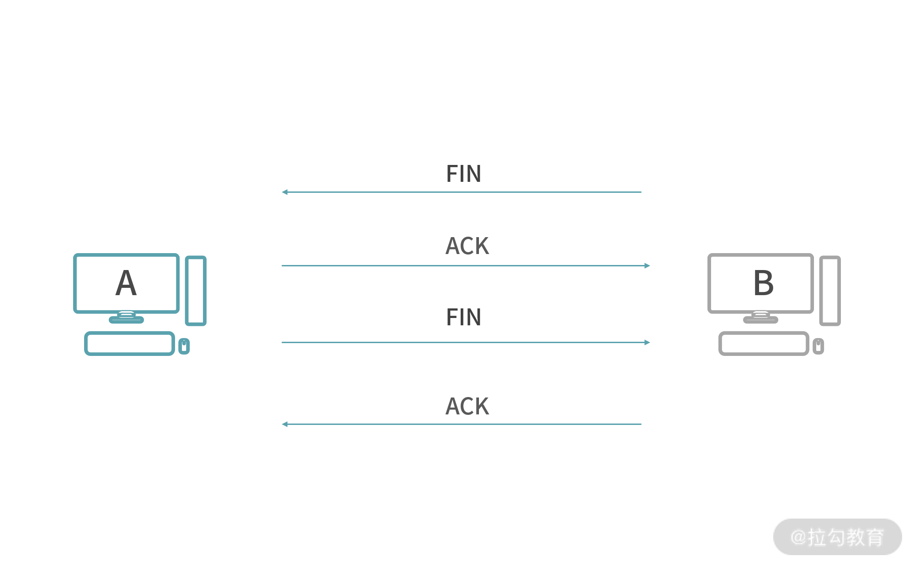

# 大纲


##  TCP/IP 5层协议

```
应用层：应用到应用（Application-To-Application）的协议。
传输层：主机到主机（Host-To-Host）的协议（port）。
网络层：ip到ip（Address-To-Address）。
数据链路层：
物理层：
```


# TCP(Transport Control Protocol)
TCP（Transport Control Protocol）是一个传输层协议，提供 Host-To-Host 数据的可靠传输，支持全双工，是一个连接导向的协议（Connection -oriented Protocol）。
##  什么是可靠性？
可靠性指数据保证无损传输。

##  建立连接的过程（3 次握手）

```
1.  客户端发消息给服务端（SYN）(一次🤝)
2.  服务端准备好进行连接
3.  服务端针对客户端的 SYN 给一个 ACK
4.  服务端发送一个 SYN 给客户端(二次🤝)
5.  客户端准备就绪
6.  客户端给服务端发送一个 ACK(三次🤝)
```
##  断开连接的过程（4 次挥手）

```
1.  客户端要求断开连接，发送一个断开的请求，这个叫作（FIN）。
2.  服务端收到请求，然后给客户端一个 ACK，作为 FIN 的响应。
3.  这里你需要思考一个问题，可不可以像握手那样马上传 FIN 回去？
其实这个时候服务端不能马上传 FIN，因为断开连接要处理的问题比较多，比如说服务端可能还有发送出去的消息没有得到 ACK；也有可能服务端自己有资源要释放。因此断开连接不能像握手那样操作——将两条消息合并。所以，服务端经过一个等待，确定可以关闭连接了，再发一条 FIN 给客户端。
4.  客户端收到服务端的 FIN，同时客户端也可能有自己的事情需要处理完，比如客户端有发送给服务端没有收到 ACK 的请求，客户端自己处理完成后，再给服务端发送一个 ACK。
```
##  TCP 的封包格式

```
TCP 协议就是依靠每一个 TCP 段工作的，所以你每认识一个 TCP 的能力，几乎都会找到在 TCP Segment 中与之对应的字段。
1.  Source Port/Destination Port 描述的是发送端口号和目标端口号，代表发送数据的应用程序和接收数据的应用程序。比如 80 往往代表 HTTP 服务，22 往往是 SSH 服务……
2.  Sequence Number 和 Achnowledgment Number 是保证可靠性的两个关键。
3.  Data Offset 是一个偏移量。这个量存在的原因是 TCP Header 部分的长度是可变的，因此需要一个数值来描述数据从哪个字节开始。
4.  Reserved 是很多协议设计会保留的一个区域，用于日后扩展能力。
5.  URG/ACK/PSH/RST/SYN/FIN 是几个标志位，用于描述 TCP 段的行为。也就是一个 TCP 封包到底是做什么用的？
  URG 代表这是一个紧急数据，比如远程操作的时候，用户按下了 Ctrl+C，要求终止程序，这种请求需要紧急处理。
  ACK 代表响应，所有的消息都必须有 ACK，这是 TCP 协议确保稳定性的一环。
  PSH 代表数据推送，也就是在传输数据的意思。
  SYN 同步请求，也就是申请握手(Synchroniation)。
  FIN 终止请求，也就是挥手(Finish)。
6.  Window 也是 TCP 保证稳定性并进行流量控制的工具。
7.  Checksum 是校验和，用于校验 TCP 段有没有损坏。
8.  Urgent Pointer 指向最后一个紧急数据的序号（Sequence Number）。它存在的原因是：有时候紧急数据是连续的很多个段，所以需要提前告诉接收方进行准备。
9.  Options 中存储了一些可选字段，比如 MSS（Maxiumun Segment Size）。
  MSS：Maximum Segment Size，TCP一次传输发送的最大数据段长度。
10. Padding 存在的意义是因为 Options 的长度不固定，需要 Pading 进行对齐。
  RTT：Round-Trip Time，往返时延，表示从发送端发送数据开始，到发送端收到来自接收端的确认（接收端收到数据后便立即发送确认），总共经历的时延。
```
### Sequence Number 和 Acknowledgement Number
Acknowledgement Number，发送方已经接收了多少数据。
注意，无论 Seq 还是 ACK，都是针对“对方”而言的。是对方发送的数据和对方接收到的数据。
### Maxiumun Segment Size
TCP一次传输发送的最大数据段长度。
```
MMS过大，带来的问题？
1.  资源的占用。一个用户占用服务器太多的资源，意味着其他的用户就需要等待或者降低他们的服务质量。
2.  支持 TCP 协议工作的 IP 协议，工作效率会下降(TCP 协议不肯拆包，IP 协议就需要拆出大量的包)，因为在网络中，每次能够传输的数据不可能太大，这受限于具体的网络传输设备，也就是物理特性。
MMS过小，带来的问题？
1.  MSS 太小的情况下，会浪费传输资源（降低吞吐量）。因为数据被拆分之后，每一份数据都要增加一个头部。如果 MSS 太小，那头部的数据占比会上升，这让吞吐量成为一个灾难。

```

##  TCP 的拆包和粘包
```
TCP 段（TCP Segment）：TCP 协议，会将数据拆分成不超过缓冲区大小的一个个部分（TCP Segment大小参考发送和接收方缓冲区大小）。
拆包：数据经过拆分，然后传输，然后在目的地重组，俗称拆包。所以拆包是将数据拆分成多个 TCP 段传输。
粘包：如果发往一个目的地的多个数据太小了，为了防止多次发送占用资源，TCP 协议有可能将它们合并成一个 TCP 段发送，在目的地再还原成多个数据，这个过程俗称粘包。所以粘包是将多个数据合并成一个 TCP 段发送。
```

# UDP
UDP 是一个面向报文（Datagram-oriented）的协议——协议双方不需要建立连接，直接传送报文（数据）。

# 其他
##  多个封包（Packet）在 Host1 和 Host2 传输

