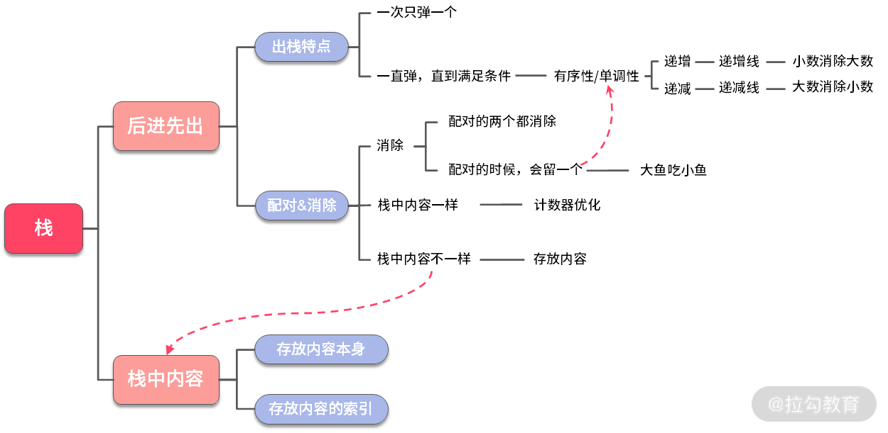
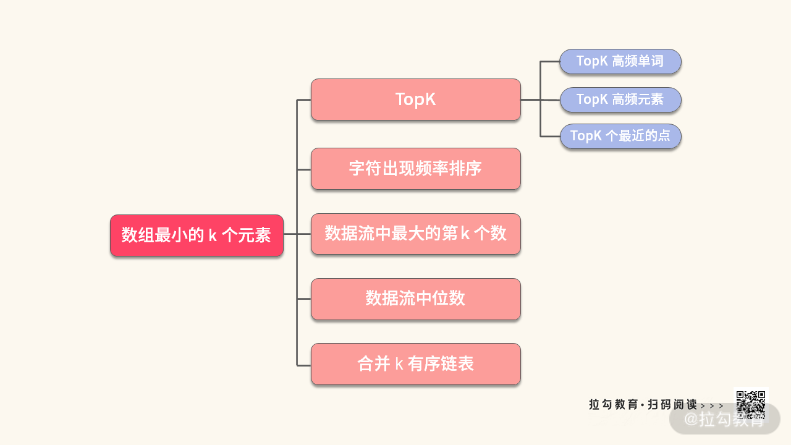

# 解题的一般步骤

1.  模拟：模拟题目的运行(画图辅助分析)。
2.  规律：尝试总结出题目的一般规律和特点。
3.  匹配：找到符合这些特点的数据结构与算法(匹配消除用栈、找相邻最小最大值用单调栈)。
4.  边界：考虑特殊情况(输入参数的判断等)。

[Algorithm-Dryad](https://github.com/lagoueduCol/Algorithm-Dryad)

# 栈（Stack）


[例子-stack](./stack.js)

## 判断字符串括号是否合法，字符串中只有字符'('和')'。

1.  使用栈匹配消除（消除一对）
2.  发现入栈只可能是"("，则直接使用单变量计数即可

## 判断字符串括号是否合法，字符串只包括 '('，')'，'{'，'}'，'['，']' 的字符串。

1.  对于多中类型元素，就需要使用栈也可以使用多个变量来分别记录

## 大鱼吃小鱼

1.  使用栈匹配消除（消除小鱼）

## 单调栈的解题技巧

1.  递增栈，栈元素是递增的（消除，较小数消除较大数）
2.  递减栈，栈元素是递减的（消除，较大数消除较小数）

## 字典序最小的 k 个数的子序列

1.  给定一个正整数数组和 k，要求依次取出 k 个数，输出其中数组的一个子序列，需要满足：1. 长度为 k；2.字典序最小

## 给定一个数组，数组中的元素代表木板的高度。请你求出相邻木板能剪出的最大矩形面积

# 队列（Queue）


[例子-queue](./queue.js)

## 二叉树的层次遍历（两种方法）

1.  从上到下按层打印二叉树，同一层结点按从左到右的顺序打印，每一层打印到一行。

## 循环队列

1.  设计一个可以容纳 k 个元素的循环队列
    只使用 k 个元素的空间，三个变量 front, rear, used 来控制循环队列的使用

## 双端队列

1.  双端队列可以从首尾两端 push/pop 元素
2.  单调队列属于双端队列的一种（单调递增、单调整递减）

## 单调队列（滑动窗口最大小值）

单调递减队列最重要的特性是：入队与出队的组合，可以在 O(1) 时间得到某个区间上的最大值。
单调递增队列最重要的特性是：入队与出队的组合，可以在 O(1) 时间得到某个区间上的最小值。
入队和出队与普通的队列不一样

```
// 单调递减队列
push(val) {
  while(!queue.isEmpty() && queue.getLast() < val) {
    queue.removeLast();
  }
  queue.addLast(val)
}
pop(val) {
  if(!queue.isEmpty() && queue.getFirst() == val) {
    queue.removeFirst();
  }
}
```

# 堆（Heap） && 优先级队列（Priority Queue）



[例子-heap](./heap.js)

## 堆的分类：大堆与小堆

堆的特点：大堆的根是最大值，小堆的根是最小值。
下面都以大堆为例。

## 堆节点 index 关系

i 结点的父结点 par = Math.floor((i-1)/2)
i 结点的左子结点 2 _ i + 1
i 结点的右子结点 2 _ i + 2

## 堆的操作

### 下沉 sink

假设 a[i] 比它的子结点要小，那么除 a[i] 以外，其他子树都满足堆的性质。这个时候，就可以通过下沉操作，帮助 a[i] 找到正确的位置。

### 上浮 swim

假设 a[i] 比它的父结点要大，并且除 a[i] 以外，其他子树都满足大堆的性质。

### push 操作

1.  往堆的尾巴 a[n] 上添加新来的元素
2.  新来元素 a[n] 进行上浮的操作

### pop 操作

1.  取出 a[0] 的值作为返回值
2.  然后将 a[n-1] 存放至 a[0]
3.  将 a[0] 进行下沉操作

# 链表（Link List）


[例子-linkList](./linkList.js)

## 链表常用的 3 个技巧：假头、新链表、双指针。

第一斧：假头。假头的作用主要是避免关于空链表的判断与讨论，假头还可以用来避免检查前驱结点为空的情况。
第二斧：新链表。新链表的引入是为了解决在旧链表中进行原地的交换、插入、删除，把复杂的操作变成在新链表中头部插入或者尾部添加。
第三斧：双指针。双指针主要是用于寻找链表中的特定结点，双指针的走法可以一次一步，可以有快有慢，出发点也可以有前有后。

## 假头（Dummy Head）或者“哑头”

实际上，就是在链表前面，加上一个额外的结点。此时，存放了 N 个数据的带假头的链表，算上假头一共有 N+1 个结点。
添加假头后，可以省略掉很多空指针的判断，链表的各种操作会变得更加简洁。

### 假头很方便进行以下 6 种操作

1.  初始化
2.  追加结点
3.  头部插入结点
4.  查找结点
5.  插入指定位置之前
6.  删除结点

#### 追加结点

1.  tail.next = new Node();
2.  tail = tail.next;
3.  链表长度+1

#### 头部插入结点

1.  新结点 p.next 指向 dummy.next；
2.  dummy.next 指向 p；
3.  如果原来的 tail 指向 dummy，那么将 tail 指向 p。

#### 查找结点

在查找索引值为 index（假设 index 从 0 开始）的结点时，你需要注意，大多数情况下，返回指定结点前面的一个结点 prev 更加有用（使用双指针）。

#### 插入指定位置之前

如果 index 大于链表长度，则不会插入结点。
如果 index 等于链表的长度，则该结点将附加到链表的末尾。
如果 index 小于 0，则在头部插入结点。
否则在指定位置前面插入结点。
当插入节点时，其实就是设置待插入节点的 next 和 val 属性（注意先要保存原来的链表）

#### 删除结点

删除结点操作是给定要删除的下标 index（下标从 0 开始）

# 树（Tree）


[例子-linkList](./tree.js)
